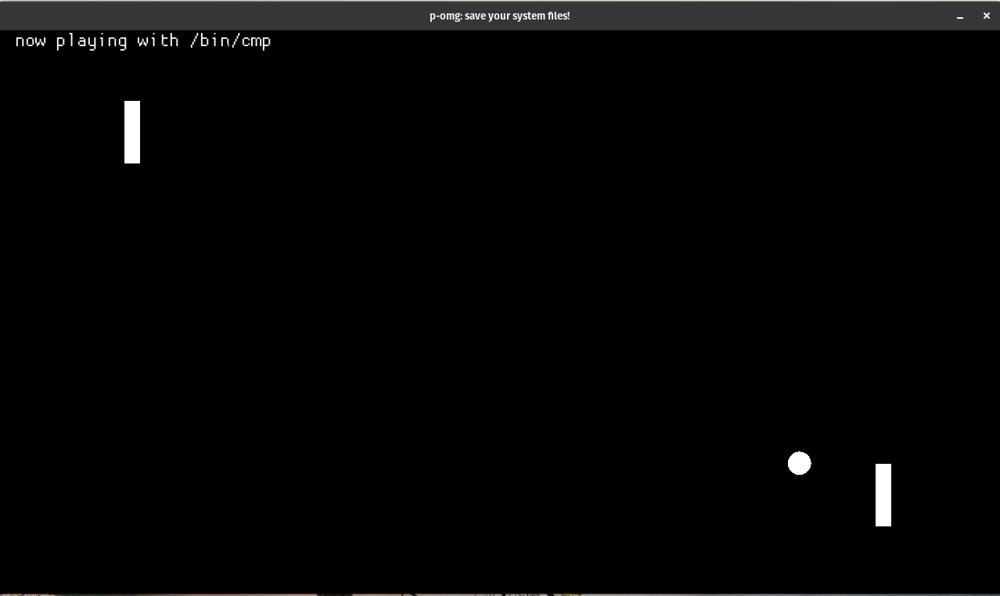
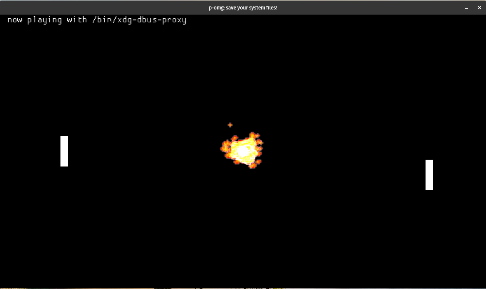

# p-omg
Pong, but the ball is a system file.

When you lose, so does your PC :(

## Warning
This will delete system files - only play on a PC you don't care about breaking...

Also, this only works on linux ^_^

